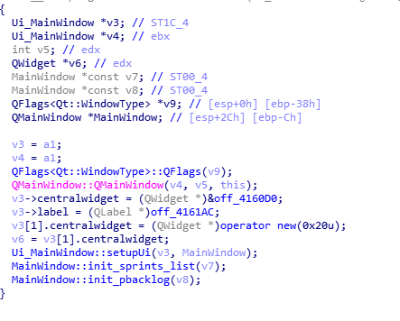
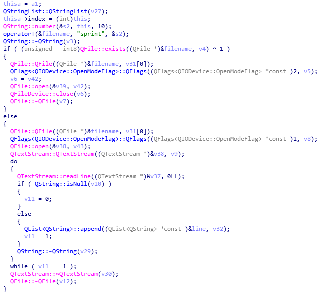
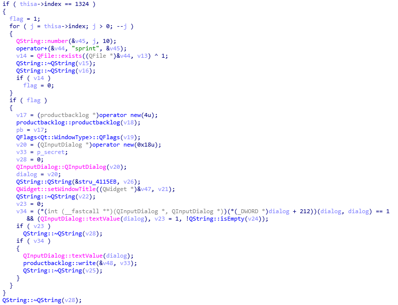
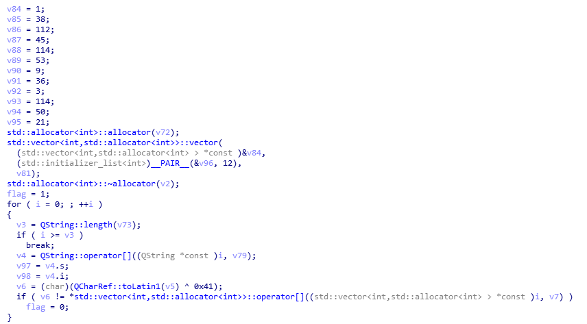

# Agile Lover

### Категория: Reverse
### Сложность: сложно

##### Описание:

Один из наших разработчиков настолько обожает Agile, что написал собственную программу для работы с ним. Также он говорит, что оставил там какой-то секретный функционал, который может исользовать только он.

##### Описание:

Флаг: `ctfcup{cut3_kUt3_Qt_cppR3}`

Пароль: `@g1l3tHeB3sT`

Декомпилируем исполняемый файл, внутри находим наиболее и нтересные для нас классы - `productbacklog` и `sprint`. Первый из них отвечает за работу с бэклогом, второй - за работу со спринтами. Конструктор `productbacklog`:

Открывается или создается файл `product_backlog`, из него читается каждая строка, которая является отдельным таском (это также можно понять, самим запустив и протестировав программу). В классе присутствуют различные методы для записи, чтения и изменения тасков.

Теперь взглянем на класс `Sprint`. Конструктор начинается практически так же, как конструктор `productbacklog`, но с использованием индекса спринта:

После чего видим какой-то интересный код:

Очевидно, происходит проверка, что индекс спринта равен `1234`. Если это так, то юзеру показывается окно для ввода строки, которая передается в метод `write` класса `productbacklog`. Мы можем попытаться создать 1323 пустых файлов спринтов вида `sprintX`, где `X` - это номер спринта, и запустить программу. Нас просят ввести пароль.

В функции `write()` присутствует следующая проверка пароля:

Простой xor и ничего больше. Пароль: `@g1l3tHeB3sT`. Дальше происходит попытка расшифровки некоторых данных с помощью нашего пароля, результат помещается в бэклог. Все что нам нужно - повторить алгоритм с найденным паролем и получить флаг.
