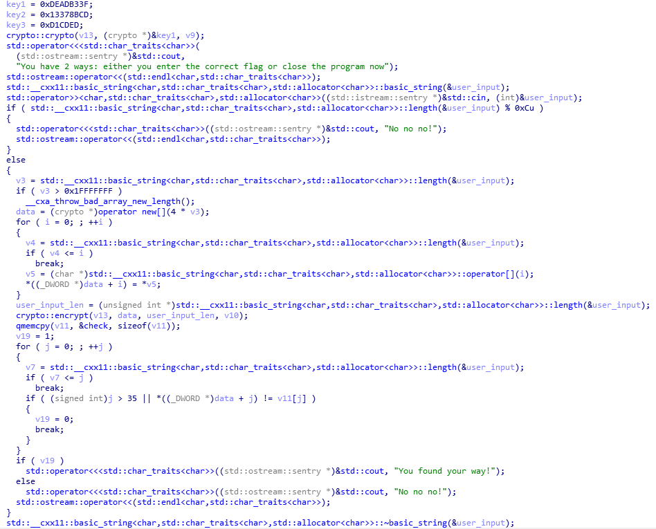
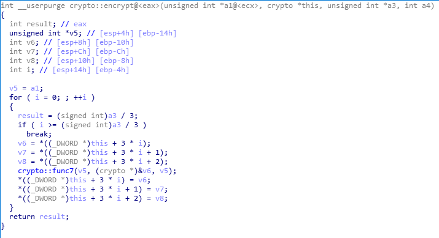
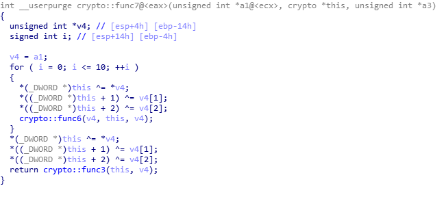

# Path

### Категория: Reverse
### Сложность: средняя

##### Описание:

У каждого свой путь в этой жизни.

##### Решение:

Flag: `ctfcup{y0ou_H4v3_0nly_tHre3_Way5sSz}`

Программа просит юзера ввести флаг, длина которого должна делиться на 12. Декомпилированная функция `main`:

Мы видим использование класса `crypto`, который, явно, имплементирует какой-то криптографический алгоритм. Перед его использованием введенный юзером флаг конвертируется в массив с элементами типа `int`, после чего массив передается в качестве аргумента метода `crypto::encrypt()`, вторым аргументом которого является длина массива. Декомпилированный метод `crypto`:

Здесь мы видим цикл, в котором берутся каждые следующие 3 элемента массива и вызывается функция `func7`. Кажется, эта функция шифрует блок из 12 байт (3 * sizeof(int)):

После тщательного изучения класса `crypto` и с некоторой помощью гугла понимаем, что это алгоритм 3-Way ([https://en.wikipedia.org/wiki/3-Way](https://en.wikipedia.org/wiki/3-Way)). Теперь мы можем легко расшифровать проверочный массив (в конце main) и получить флаг.
