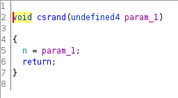
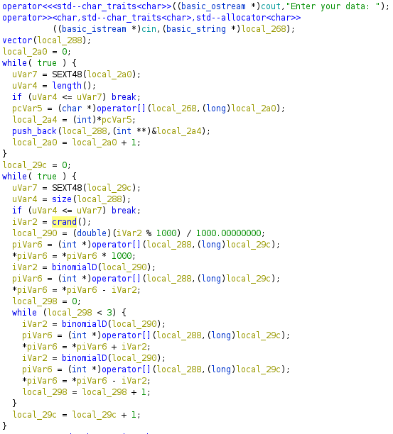
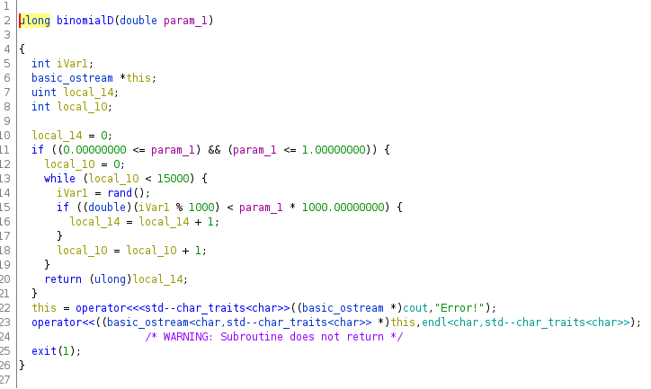

# Randomizer

### Категория: Reverse
### Сложность: средняя

##### Описание:

Так много рандома... Здесь никак не получится восстановить исходные данные.

##### Решение:

Флаг: `ctfcup{GgCaQufiyP6ETxj3IYaz9JLkVU9J}`

Декомпилируем экзешник и смотрим функцию `main`. В начале вызываются две функции - `srand` и еще одна неизвестная. После некоторого изучения понимаем, что вторая является кастомным `srand` с известным нам передаваемым параметром для настройки seed, который будет использоваться впоследствии в кастомном `rand`:

Введенные данные помещаются в вектор и обрабатываются в цикле:

Здесь генерируется рандомное число, используя кастомную функцию, текущий элемент вектора умножается на 1000 и выполняются операции суммы и разности с элементом, используя какую-то новую функцию, которая принимает сгенерированное число в качестве аргумента. Эта функция является симуляцией биномиального распределения с параметрами `p` (передаваемым в качестве аргумента функции) и `n`(константа, 15000) для получения рандомных чисел:

Теперь мы можем попытаться получить математическое ожидание для каждого распределения, используя псевдорандомные числа с известным seed для каждого соответствующего элемента в наших данных. После чего делим каждый элемент на 1000 и округляем до ближайшего целого числа, получая флаг.
