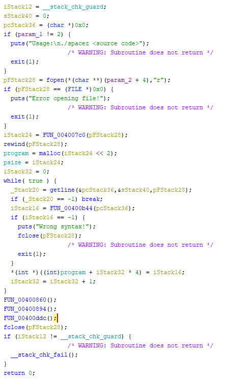

# SpaceZ

### Категория: Reverse
### Сложность: сложно

##### Описание:

Мы разработали новый язык программирования SpaceZ. Нам он кажется очень простым и удобным, но у нас до сих пор нет документации... Однако мы обещаем, что она появится через пару дней (когда наш единственный разработчик, знающий, как это все работает, вернется из отпуска). Но вы все равно можете пока протестировать нашу бета версию :)

##### Решение:

Флаг: `ctfcup{V1rtUaL1Z4t10n_lL4ngu4ge}`

Нам дается исполняемый файл для архитектуры mips и какой-то дополнительный файл, заполненный пробелами и символами новой строки. Пробуем декомпилировать первый файл в Ghidra - очевидно, что перед нами виртуальная машина. В начале происходит выделение памяти под программный код (ее размер равен количеству строк в файле с программой). После чего начинается парсинг исходгого файла и подсчет пробелов на каждой строке, число которых является байткодом виртуальной машины, помещаемое в массив `program`.

Вызываются 3 функции - первая и вторая инициализируют очередь (вместо стандартного стека) и регистры (кстати, там 5 регистров, пятый из которых является instruction pointer, как мы увидим далее), третья исполняет программу. Полная функция main:

Функция, выполняющая программу, наиболее сложная. Мы можем увидеть, что виртуальная машина поддерживает 21 различную инструкцию. К примеру, первая (с опкодом 0) очищает очередь, вторая - кладет значение из регистра в очередь (занимает 2 байткода - опкод и номер регистра (проверяется, что он в пределах от 0 до 3)). Вы найдете конвертер всех инструкций из "псевдоасма" в `.sz` в папке `solution`.

Зная все инструкции, нетрудно понять алгоритм в `source.sz`. Алгоритм на asm и решение также лежит в `solution`.
